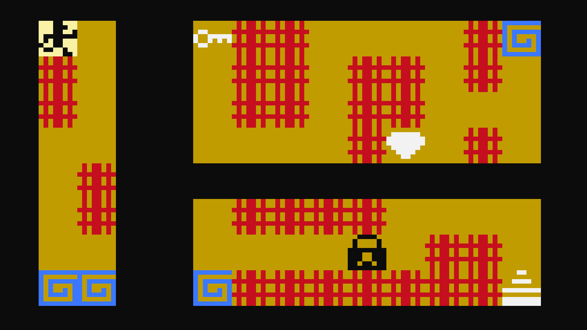

<h1 align="center">  Larcin Lazer </h1>

  
  

  
  
  

Un jeu fait par Marina SECORD et Nino SANDLARZ

Le jeu Larcin Lazer appartient à Doc Geraud et nous avons fait celui ci en ASCII à but éducatif dans le cadre d'un TP pour l'ENJMIN.
- - - - - - - - - - - - - - - - - - - - - - - - - - - - - - - -
Nous avons réalisés pour ce projet :
- Un jeu avec une architecture bas niveau comprenant 6 niveaux et des menus
- Un système de sprites et de gestion de scène complexe et propre
- Plusieurs types de dalles avec lasers, clef/porte, diamants gardés en mémoire, portails

- - - - - - - - - - - - - - - - - - - - - - - - - - - - - - - -
Controles :

- ZQSD pour se déplacer
- U pour confirmer
- ESC pour quitter/retourner dans les menus

